<pre align="center">
  ___ ___  __  __ ___  _
 / __/ _ \|  \/  | _ \/ \
| (_| (_) | |\/| |  _/ _ \
 \___\___/|_|  |_|_|/_/ \_\
</pre>

<p align="center">
  <strong>SP-404 MK II &amp; P-6 Companion</strong>
</p>

<p align="center">
  <a href="#quick-start"></a>
  <a href="#supported-hardware"></a>
  <a href="LICENSE"></a>
  <a href="https://www.python.org/"></a>
  <a href="https://raredata.net"></a>
</p>

---

Compa turns a Raspberry Pi and touchscreen into a multi-device control surface, recorder, sampler, and transfer hub for your hardware. Plug in up to three USB devices, and Compa auto-detects each one, adapts its interface, and connects everything through a single unified workflow: **Record, Slice, Build Kit, Push to Device.**

No desktop environment. No web browser. Just a direct pygame UI on KMSDRM, built for live use with your fingers.

---

## Table of Contents

- [Features](#features)
- [Supported Hardware](#supported-hardware)
- [MIDI Controllers](#midi-controllers)
- [Multi-Device Hub](#multi-device-hub)
- [Screens](#screens)
- [Cross-Device Workflow](#cross-device-workflow)
- [Screenshots](#screenshots)
- [Quick Start](#quick-start)
- [Configuration](#configuration)
- [Display Compatibility](#display-compatibility)
- [Keyboard Shortcuts](#keyboard-shortcuts)
- [Project Structure](#project-structure)
- [Contributing](#contributing)
- [License](#license)
- [Credits](#credits)

---

## Features

### Multi-Device Hub
- Connect up to **3 USB devices simultaneously** with independent MIDI connections
- **Auto-detection** via USB vendor/product IDs and Linux sysfs scanning
- **Hot-plug** support -- connect and disconnect devices without restarting
- **Audio routing** between devices (e.g. SP-404 output into P-6 input)
- **MIDI clock relay** from Compa to all connected devices
- Tap a device name in the nav bar to switch focus

### Recording & Capture
- Record from any connected USB audio device
- **Input source selector** -- choose which device to record from
- **60-second recall buffer** -- forgot to press record? Capture the last minute
- **Threshold recording** -- auto-start on signal, auto-stop on silence
- Take management with star, rename, delete, and BPM/pattern metadata
- Samba network share for Mac/PC access to all recordings

### Sample Editing
- **Visual waveform slicer** -- see the full waveform, place slice markers
- Start/end trim with **snap-to-zero-crossing** (no clicks or pops)
- Auto-slice into 2, 4, 8, or 16 equal parts
- Normalize, convert to mono, downsample
- Zoom for precision editing
- Export slices directly to any connected device

### Format Conversion
| Target | Format |
|--------|--------|
| **Roland P-6** | 44.1 kHz, 16-bit, mono WAV |
| **Roland SP-404 MK2** | 48 kHz, 16-bit, stereo WAV |
| **Akai MPC / Force** | `.Drum.xpm` program (template-based from Force) |
| **Ableton Live** | `.adg` Drum Rack (template-based, gzipped XML) |

Record on one device, convert, load on another. Cross-device sample sharing in seconds.

### Kit Builder
- **4x4 pad grid** with **8 banks** (128 pads total)
- Drag samples onto pads from the file browser
- **Smart import** -- auto-detect drum types (kick, snare, hat, clap, etc.) from folder and file names using pattern matching against common sample library conventions
- Waveform preview per pad
- Export as Akai `.xpm` drum program or Ableton `.adg` Drum Rack

### Internet Radio
- **137 stations** across 25+ genres (Jazz, Soul, Funk, Lo-fi, Hip Hop, Metal, Classical, Electronic, Vintage, Paranormal, and more)
- ICY metadata -- current artist and track displayed live
- Full-width real-time waveform visualizer
- **Capture buffer** -- save the last 60 seconds of any stream as WAV
- Manual or threshold-based recording from radio

### Pattern Sequencing
- Pattern grid view (4x4 or 8x8 depending on device)
- **Chain / Song mode** -- program pattern sequences with bar counts and FX snapshots
- Pi-side step sequencer: 6-pad x 16-step grid (expandable to 64 steps)
- Special row types for SP-404 MK2: **Chromatic**, **Ghost Kick** (sidechain trigger), **EXT SOURCE** (gate live audio input)
- Step probability for generative patterns

### LFO Automation
- Sine, triangle, saw (up/down), square, random, and sample-and-hold waveforms
- Modulate any MIDI CC parameter at configurable rates (0.01 Hz to 30 Hz)
- Multiple simultaneous LFO targets
- 30 Hz update rate -- smooth enough for filter sweeps, light on CPU

### Performance & Control
- **Tap tempo / master MIDI clock** with sub-millisecond timing (hybrid sleep/spin-wait)
- Device-adapted CC knob screens -- different layout per device
- Granular engine presets (P-6): save and recall all 14 parameters
- Transport control: Play / Record / Stop per device
- Real-time oscilloscope and level meters per device card

### MIDI Controllers
- **Plug-and-play MIDI input** — any USB MIDI keyboard or controller is auto-detected
- **Midi Fighter Twister deep integration** — 16 knobs mapped to SP-404 FX slots with RGB LEDs showing effect color
- **Chromatic keyboard (KEYS tab)** — play any SP-404 pad or P-6 sample melodically across two octaves
- **Touch-to-play piano** on the screen — works without a hardware keyboard
- **LATCH mode** for holding chords, **octave shift ±3**, **velocity-sensitive**
- Routes to the focused device on its designated chromatic channel (SP-404 Ch16, P-6 Ch4)
- Hot-plug aware — disconnect and reconnect without restarting

### Utility
- One-button **backup / restore** for device contents
- Session notes (auto-saved)
- **3 searchable reference manuals** (Compa, P-6, SP-404 MK2)
- Resample calculator -- bar durations at current BPM vs. sample rates
- Touch calibration
- Hardware-inspired color themes (P-6 yellow, SP-404 teal, Force red)

---

## Supported Hardware

| Device | Audio | MIDI Control | Patterns | Backup | Sample Transfer |
|--------|-------|-------------|----------|--------|-----------------|
| **Roland P-6** | 2-in / 2-out, 44.1 kHz | Granular, Filter, Envelope, Mixer, FX (40+ CCs) | 64 patterns | Full backup/restore | Slicer and format converter |
| **Roland SP-404 MK2** | 2-in / 4-out, 48 kHz | 5-bus FX with named effects, DJ mode, Looper (25+ CCs) | 16 patterns | SD card backup | Slicer and format converter |
| **Akai Force / MPC** | -- | -- | -- | -- | USB file transfer (Computer Mode), XPM drum program export |
| **Midi Fighter Twister** | -- | Deep: 16 knobs → SP-404 FX slots, RGB LED feedback | -- | -- | -- |
| **Midi Fighter Spectra** | -- | Pad mapping for SP-404 with HOLD (deeper integration in progress) | -- | -- | -- |
| **PreSonus ATOM SQ** | -- | Pad trigger, transport, touch-strip CC, PAD/PATTERN/CONTROL layers | -- | -- | -- |
| **Any USB MIDI keyboard** | -- | Chromatic play via KEYS tab (Alesis, Arturia, AKAI, Novation, etc.) | -- | -- | -- |
| **Any USB audio device** | Record / playback | -- | -- | -- | -- |

### SP-404 MK2 Effects Coverage

Compa includes the complete SP-404 MK2 effects list with named presets per bus:

- **Bus 1 and 2** -- 42 effects including Scatter, Ha-Dou, Ko-Da-Ma, Tape Echo, JUNO Chorus, Cloud Delay, and more
- **Bus 3 and 4** -- 40 effects with a different ordering, no Direct FX
- **Input FX** -- 18 effects focused on vocal and amp processing

All effect selection is via CC with human-readable names displayed on screen.

---

## MIDI Controllers

Compa works with any USB MIDI controller — plug in and it's detected automatically within 2 seconds. Compa recognizes specific controllers with deep integrations, and treats everything else as a generic MIDI keyboard.

### Midi Fighter Twister (deep integration)

The DJ TechTools Midi Fighter Twister gets a full SP-404 FX control surface:

- **16 encoders = 16 SP-404 effect slots** — each knob is pre-assigned to an effect (To-Gu-Ro, Scatter, Tape Echo, Stopper, etc.)
- **Press a knob to activate the effect** on the currently selected bus. Press again to turn it off.
- **Turn the knob to sweep Ctrl 1** of that effect in real time
- **RGB LEDs reflect effect color** — each FX slot has a color that matches the effect type (red/orange for distortion, blue/cyan for modulation, green for filters, purple for time-based)
- **Focus mode** — press a knob to focus on one effect; all other LEDs dim so you can see what's active
- **Multi-page support** — scroll through banks of effects (the P-6 gets its own 16-knob page for granular parameters)
- **Auto-map on startup** — no configuration needed. Plug it in, it's mapped.
- **Customizable** — swap which effect is on which knob via the settings screen

The Twister is the recommended physical controller for anyone using Compa with an SP-404 MK2. It's faster than navigating FX menus on the SP itself and the LED feedback makes live performance much more readable.

### Chromatic MIDI Keyboards

Plug in any USB MIDI keyboard — Alesis V49, Arturia KeyStep, AKAI MPK Mini, Novation Launchkey, PreSonus ATOM SQ, etc. — and play any loaded sample melodically:

- **Two-octave range** from the KEYS tab of a device workspace
- **Plays the focused device** on its designated chromatic channel: SP-404 MK2 on MIDI Ch 16, P-6 on MIDI Ch 4 (granular engine)
- **Visual piano display** shows active notes with velocity color
- **Latch mode** — tap keys to hold chords
- **Octave shift ±3** — extends the playable range across the MIDI spectrum
- **Touch-to-play** on the screen — works even without a hardware keyboard
- **Pad selector** — tap any pad across all banks to audition the sound before committing
- **All notes off** when switching tabs or leaving the workspace (no stuck notes)

For the SP-404, Ch16 chromatic is a hardware-only mode on the SP itself — tap the pad on the SP, press SHIFT + PAD 4 (CHROMATIC), then Compa's keyboard plays that sample across the keys. For the P-6, chromatic routing is fully MIDI-controlled and works immediately.

### General USB MIDI Input

Anything else plugged in:

- Auto-detected and routed through the chromatic keyboard module
- Notes and CC forwarded to the focused device on its chromatic channel
- Pitch bend supported on devices that accept it (SP-404 Ch16 / Ch11 vocoder)
- Excludes known devices (SP-404, P-6, ATOM SQ, Twister, Spectra, Force) so their own dedicated connections aren't duplicated
- Disconnect and reconnect freely — Compa rescans every 2 seconds

### Midi Fighter Spectra

Basic pad mapping today with color-coded banks for SP-404 effects and HOLD functionality. A deeper integration is in progress based on recent firmware discoveries — expect this section to grow.

### ATOM SQ

The PreSonus ATOM SQ is a dedicated performance controller with its own routing module:
- 32 pads map to SP-404 sample triggering
- Transport buttons control Compa's master clock
- Touch-strip routes to CC for expressive control
- Layer system switches between PAD / PATTERN / CONTROL modes

---

## Multi-Device Hub

```
   +-----------+     USB     +-----------+     USB     +-----------+
   | Roland P-6 |<---------->|           |<---------->| SP-404 MK2 |
   +-----------+    Audio    |   COMPA   |    Audio    +-----------+
                    + MIDI   |           |    + MIDI
   +-----------+     USB     |  Pi + 7"  |
   | Akai Force |<---------->| Touchscr. |
   +-----------+   Storage   +-----------+
```

- Each device gets its own MIDI connection on the correct channels
- Session screen shows a **playing card per device** with oscilloscope, meters, and transport buttons
- Device color themes adapt automatically (yellow for P-6, teal for SP-404, red for Force)
- Audio can be routed between devices via lock-free ring buffers with sample rate conversion
- MIDI clock is relayed from Compa's master clock to all connected devices simultaneously

---

## Screens

| # | Screen | Description |
|---|--------|-------------|
| 1 | **SESSION** | Device cards showing BPM, transport state, oscilloscope, Play/Rec/Stop per card |
| 2 | **CONTROL** | CC parameter knobs adapted per device (P-6 granular engine, SP-404 5-bus FX + looper + DJ mode) |
| 3 | **PATTERN** | Grid view (4x4 or 8x8), chain/song mode with FX snapshots, step sequencer with chromatic/ghost/EXT SOURCE rows |
| 4 | **RECORD** | Record from any device, input source selector, 60s recall buffer, threshold recording, level meters |
| 5 | **SAMPLE** | Folder browser, visual waveform slicer, format converter (P-6 / SP-404 / MPC / Ableton) |
| 6 | **RADIO** | 137 internet radio stations, real-time visualizer, capture buffer, threshold recording |
| 7 | **KIT BUILDER** | 4x4 pad grid, 8 banks (128 pads), smart drum import, waveform preview, export XPM + ADG |
| 8 | **XFER** | Push/pull files to MPC/Force via USB Computer Mode, SD card and SSD drive selector |
| 9 | **SETTINGS** | Device config, audio routing, MIDI clock relay, themes, touch calibration |
| 10 | **HELP** | 3 searchable reference manuals (Compa, P-6, SP-404 MK2) |

---

## Cross-Device Workflow

Compa is designed around a single continuous flow that works across any combination of connected devices:

```
 RECORD          SAMPLE           KIT BUILDER        XFER
 ------          ------           -----------        ----
 Capture audio   Load WAV         Drop slices        Push kit to
 from any     -> Slice it up   -> onto 128-pad    -> MPC/Force via
 device or       Trim, normalize  grid. Auto-detect   USB, or export
 radio stream    Export slices     drum types.         for SP-404/P-6
```

**Record** from your SP-404. **Slice** the recording. **Build a kit** from the slices (auto-detecting kick, snare, hat). **Push** the finished kit to your MPC Force as an XPM drum program, or export as an Ableton Drum Rack. All without leaving Compa.

---

## Screenshots

Running on a Raspberry Pi 3B with a 7" DSI touchscreen. Dark theme with per-device accent colors — orange for SP-404, yellow for P-6, red for Force.

### Boot Splash

<p align="center">
  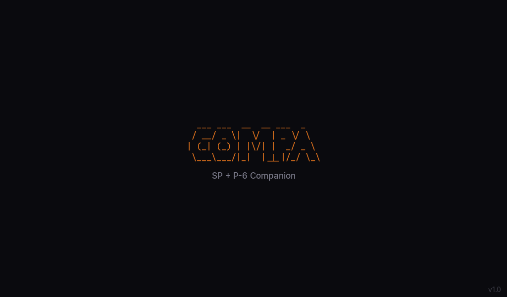
  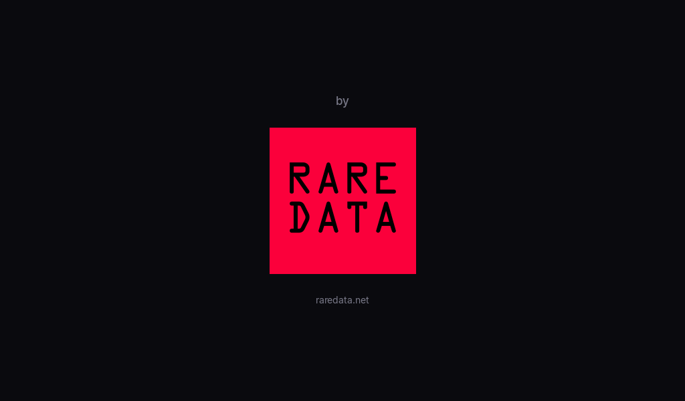
</p>

### Main Dashboard

The session screen shows every connected device side-by-side with live oscilloscopes, BPM, pattern info, and recall buffer status.

<p align="center">
  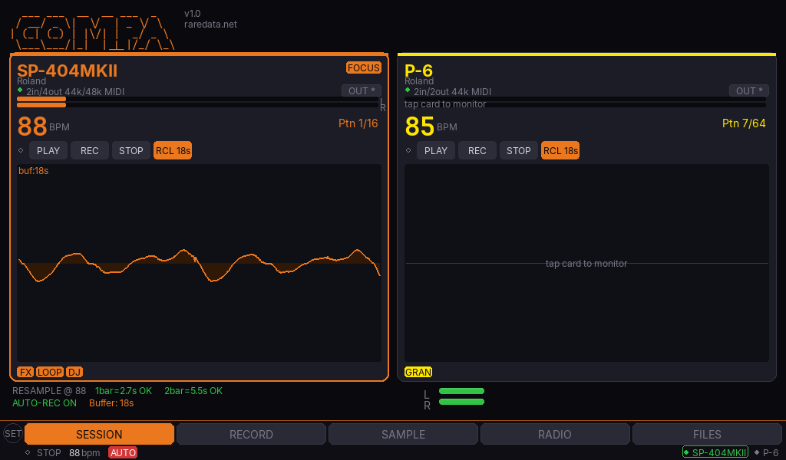
</p>

### Device Workspaces

Tap a device card and Compa opens a full-screen workspace with a live oscilloscope and per-device control tabs.

**SP-404 MK2** — Bus FX knobs, 16-slot Twister grid, chromatic keyboard, sequencer, looper, DJ mode:

<p align="center">
  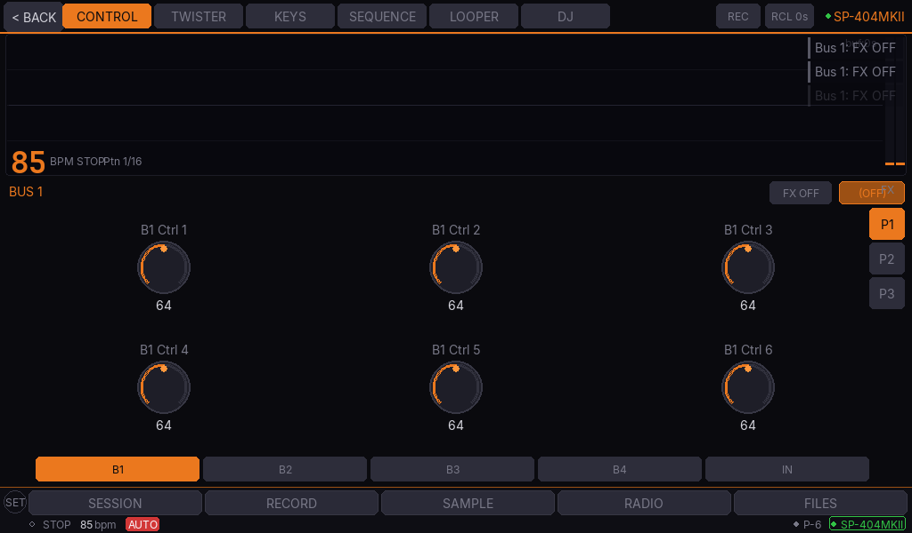
  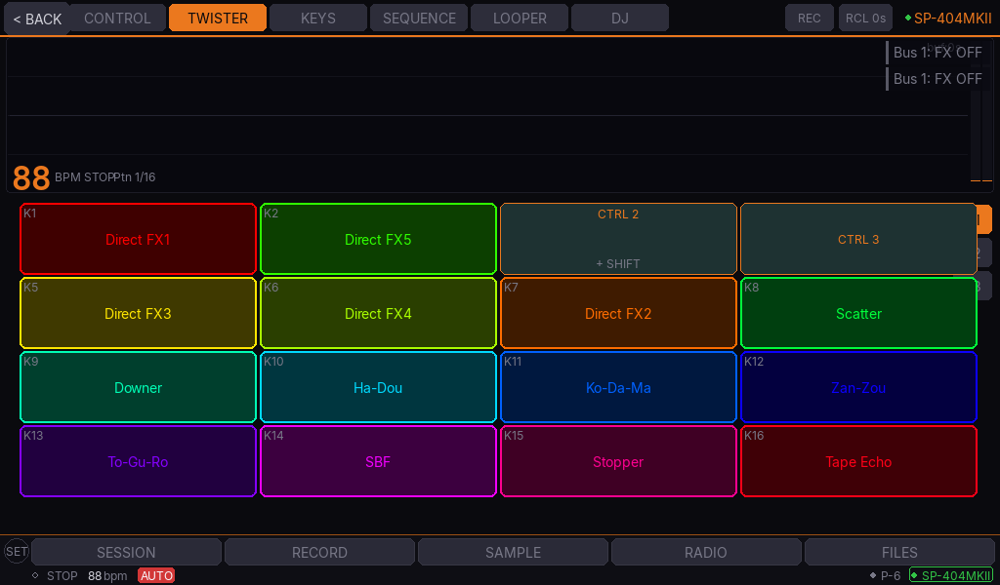
</p>
<p align="center">
  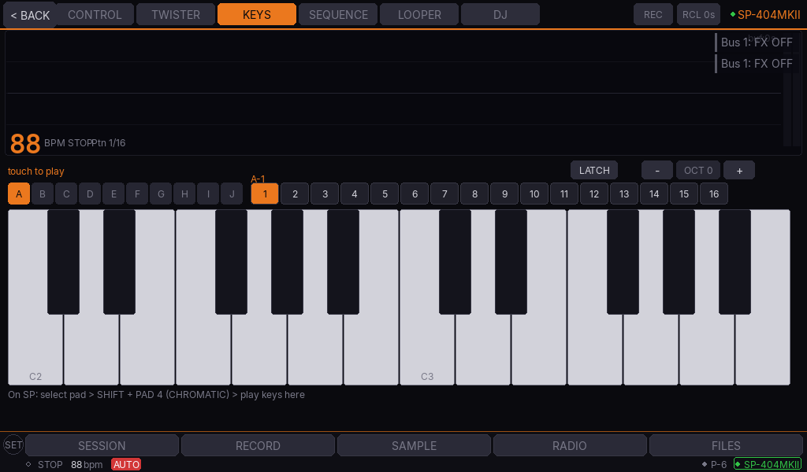
  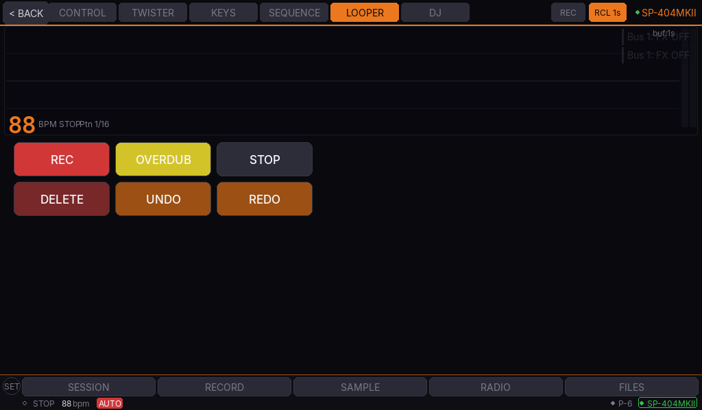
</p>

**Roland P-6** — Granular engine control, chromatic keyboard, pattern sequencer:

<p align="center">
  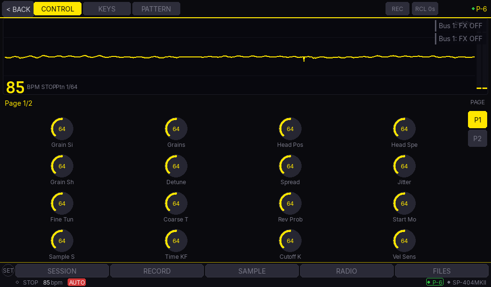
  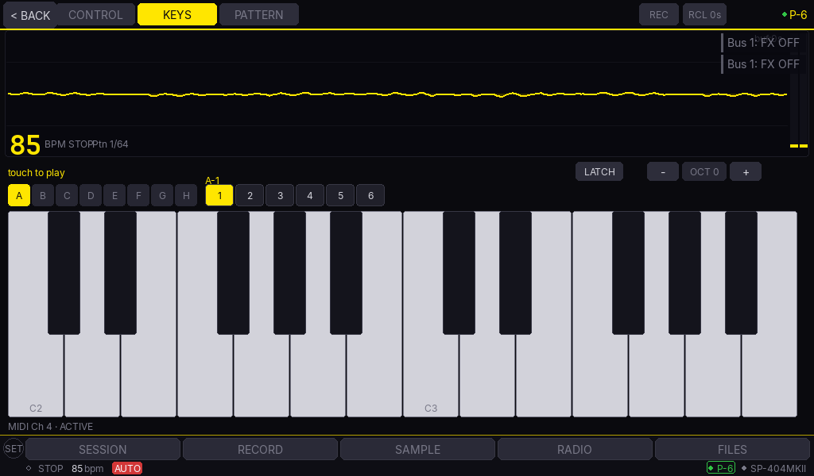
</p>

### Chromatic Keyboard (KEYS tab)

Plug in any USB MIDI keyboard (Alesis V49, Arturia KeyStep, AKAI MPK, etc.) and play any pad chromatically. Visual piano with active-note highlighting, octave shift, LATCH mode, and touch-to-play on the screen.

<p align="center">
  
</p>

### Recording & Samples

<p align="center">
  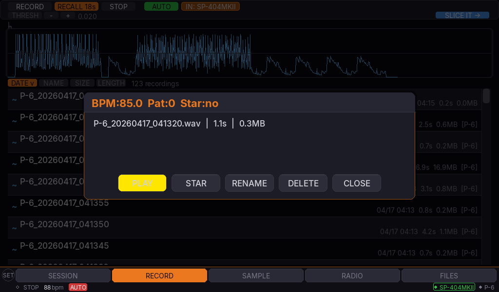
  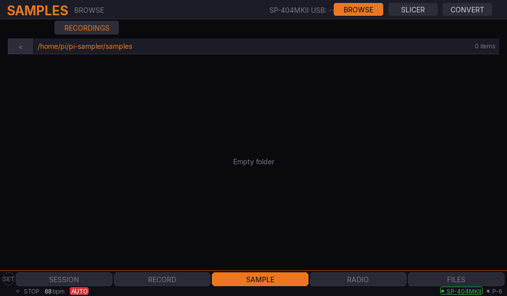
</p>

### Internet Radio

Built-in browser for 90+ curated stations — jazz, lo-fi, hip-hop, ambient, world. Route the stream into any connected device for resampling.

<p align="center">
  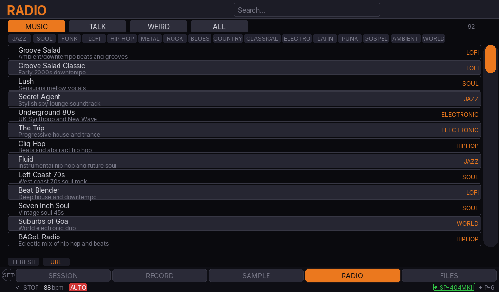
</p>

### Files & Network

Full file manager with dual-pane peer-to-peer transfer between Compas on the same LAN.

<p align="center">
  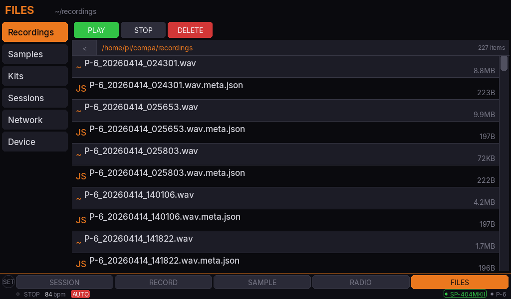
</p>

### Kit Builder

Assign samples to a 128-pad grid (8 banks × 16 pads) and export as Akai MPC (.xpm) or Ableton (.adg) drum kits.

<p align="center">
  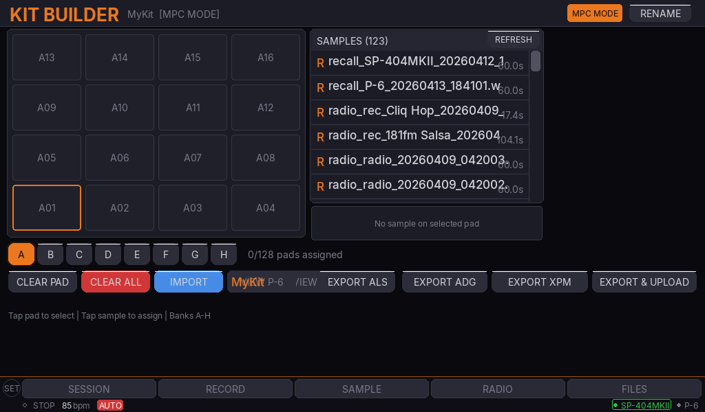
</p>

### Settings & Connectivity

Per-device color picker, MIDI controller mapping, WiFi/Bluetooth config, touchscreen keyboard for password entry.

<p align="center">
  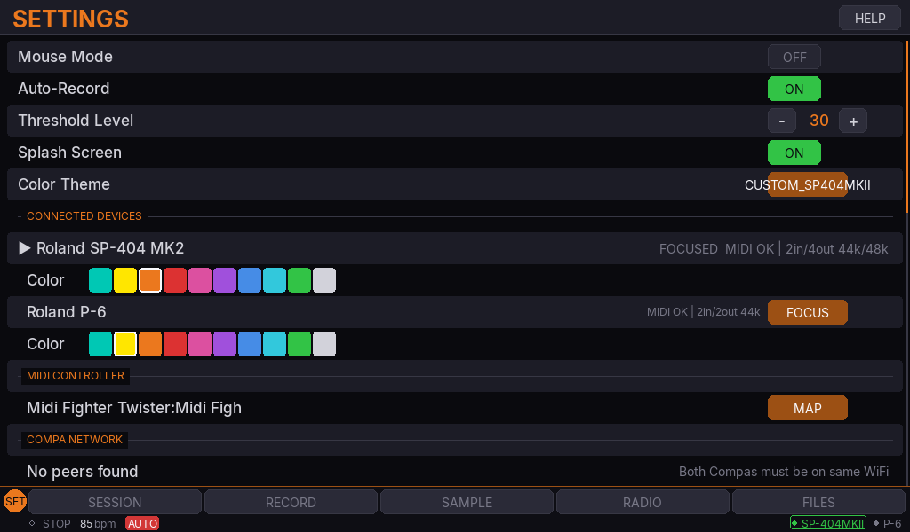
  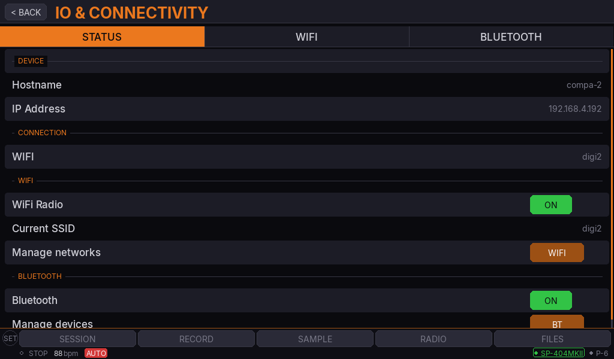
</p>

### Built-in Manual

Every screen, feature, and workflow documented in the help system — searchable on-device.

<p align="center">
  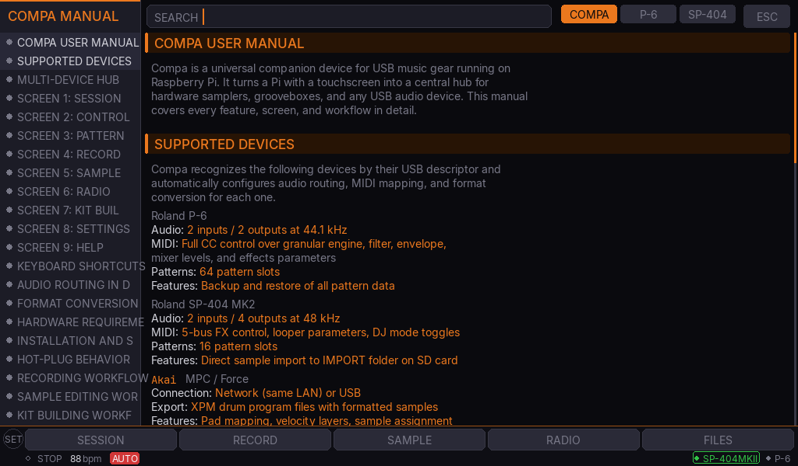
</p>

---

## Quick Start

### Requirements

- **Raspberry Pi 3B+**, 4, or 5
- **7" HDMI or DSI touchscreen** (800x480 or higher)
- **USB music device** (Roland P-6, SP-404 MK2, Akai Force/MPC, or any USB audio interface)
- **USB data cable** (must be data-capable, not charge-only)
- **Official Pi power supply** (2.5A minimum)
- **SD card** (16 GB+, Class 10 or faster)

### Install

```bash
# 1. Flash Raspberry Pi OS Lite (64-bit) to SD card
#    Use Raspberry Pi Imager. Set username: pi, enable SSH, configure WiFi.

# 2. SSH in
ssh pi@compa.local

# 3. Clone the repo
git clone https://github.com/macdigi/compa.git
cd compa

# 4. Create virtual environment (system-site-packages for pygame/numpy)
python3 -m venv venv --system-site-packages
source venv/bin/activate

# 5. Install Python dependencies
pip install pygame sounddevice soundfile numpy python-rtmidi evdev

# 6. Install system packages
sudo apt update
sudo apt install -y ffmpeg libts-bin samba

# 7. Install fonts (bundled in docs/fonts/)
sudo mkdir -p /usr/local/share/fonts
sudo cp docs/fonts/*.ttf /usr/local/share/fonts/
sudo fc-cache -f

# 8. Set up the systemd service
sudo cp setup/compa.service /etc/systemd/system/
sudo systemctl daemon-reload
sudo systemctl enable compa
sudo systemctl start compa
```

### Samba Share (optional)

To access recordings from your Mac or PC over the network, add this to `/etc/samba/smb.conf`:

```ini
[compa]
   path = /home/pi/compa
   browseable = yes
   read only = no
   guest ok = yes
```

Then restart Samba:

```bash
sudo systemctl restart smbd
```

On macOS: Finder > Go > Connect to Server > `smb://compa.local/compa`

---

## Configuration

Edit `setup/config.env` to customize your setup:

```bash
# Network sample library (optional -- mount from Mac/PC via SSHFS)
MAC_MINI_IP=192.168.1.XXX
MAC_MINI_USER=charlie
REMOTE_SAMPLE_DIR=/Users/charlie/Music/Samples

# Audio
AUDIO_DEVICE=default
BUFFER_SIZE=256          # 256 frames = ~5.8ms latency at 44.1kHz
SAMPLE_RATE=44100

# MIDI
MIDI_BASE_NOTE=36        # Bottom pad = MIDI note 36 (C2)
```

### Setup Scripts

The `setup/` directory includes four numbered scripts that configure a fresh Pi:

| Script | Purpose |
|--------|---------|
| `01-base-setup.sh` | System packages, Python, venv |
| `02-audio-setup.sh` | ALSA config, USB audio permissions |
| `03-network-mounts.sh` | SSHFS mount, Samba share |
| `04-autostart.sh` | systemd service, boot-to-Compa |

---

## Display Compatibility

| Screen | Resolution | Connection | Touch | Experience |
|--------|-----------|------------|-------|-----------|
| 7" HDMI | 800x480+ | HDMI + USB | Capacitive | Best -- full touch, designed for this |
| 7" DSI (official) | 800x480 | DSI ribbon | Capacitive | Excellent -- no extra USB needed |
| 5" HDMI | 800x480 | HDMI + USB | Capacitive | Good |
| 3.5" SPI | 480x320 | GPIO SPI | Resistive | Functional -- mouse recommended |
| Any HDMI monitor | Varies | HDMI | Mouse | Works fine |

---

## Keyboard Shortcuts

For development or when using Compa with a keyboard attached:

| Key | Action |
|-----|--------|
| `F1` -- `F6` | Switch screens (Session, Control, Pattern, Record, Sample, Radio) |
| `F7` | Help / reference manual |
| `F8` | Settings |
| `Space` | Transport start / stop |
| `R` | Toggle recording |
| `A` | Toggle auto-record |
| `M` | Toggle mouse mode |

---

## Project Structure

```
compa/
  engine/                 Audio engine, MIDI, device detection, format conversion
    audio_engine.py         Real-time audio mixer (lock-free, numpy vectorized)
    audio_router.py         Route audio between USB devices with SRC
    device_detect.py        USB sysfs scanning and auto-detection
    device_profiles.py      DeviceProfile dataclass + built-in profiles
    drum_detector.py        Auto-classify samples as kick/snare/hat/etc.
    drum_mapper.py          Map detected drums to MPC pad layout
    format_converter.py     WAV conversion + XPM/ADG generation
    midi_clock.py           Master MIDI clock with tap tempo
    midi_lfo.py             LFO automation (sine/tri/saw/sq/random/S&H)
    midi_router.py          MIDI routing hub between controller and devices
    p6_midi.py              Roland P-6 MIDI implementation
    p6_sequencer.py         Step sequencer with chromatic/ghost/EXT SOURCE rows
    p6_chain.py             Pattern chain / song mode
    p6_presets.py           Granular engine preset save/recall
    radio_stream.py         Internet radio via ffmpeg with 60s capture buffer
    recorder.py             Multi-device recorder with threshold and recall
    sample_slicer.py        Waveform slicing engine
    sp404_effects.py        Complete SP-404 MK2 effect lists (all 5 buses)
    usb_storage.py          MPC/Force USB mass storage auto-mount and transfer
    ...
  ui/                     Pygame application and screens
    app.py                  Main app loop, screen manager, nav bar
    screens/                One module per screen (session, control, pattern, etc.)
    components/             Reusable widgets (pad_grid, waveform, knob, button, modal, etc.)
  docs/                   Reference data and templates
    fonts/                  Inter + JetBrains Mono (bundled)
    radio_stations.json     137 internet radio stations
    akai_drum_template.xpm  Golden Akai Force/MPC drum program template
    ableton_drumrack_template.adg  Ableton Live Drum Rack template
    compa_reference.txt     Compa reference manual
    p6_reference.txt        Roland P-6 reference manual
    sp404_reference.txt     SP-404 MK2 reference manual
  kits/                   Saved kit JSON files
  samples/                Local sample cache
  setup/                  Pi setup scripts + config
  requirements.txt        Python dependencies
```

---

## Contributing

Contributions welcome — pull requests, bug reports, new device profiles, and radio stations all appreciated.

### Getting Started

1. Fork the repo and clone your fork:
   ```bash
   git clone https://github.com/YOUR-USERNAME/compa.git
   cd compa
   ```
2. Create a branch for your change: `git checkout -b feature/my-change`
3. Run Compa on your Pi or test locally with pygame (see `setup/`)
4. Commit, push, and open a pull request against `main`

### Ways to Contribute

- **Report issues** — open a GitHub issue with your Pi model, connected device(s), firmware version, and steps to reproduce. Screenshots and `journalctl -u compa` logs help a lot.
- **Device profiles** — expand Compa's hardware support by adding a new profile. See [`engine/device_profiles.py`](engine/device_profiles.py) for the pattern. USB VID/PID, MIDI channels, CC maps, and audio channel counts are all configurable per-device.
- **Radio stations** — submit station URLs via PR to [`docs/radio_stations.json`](docs/radio_stations.json). Include name, genre, bitrate, and a working URL.
- **Documentation** — fixing typos, improving setup instructions, clarifying device-specific quirks, or adding diagrams to this README all make the project more accessible.
- **Features & bug fixes** — check the [issues tab](https://github.com/macdigi/compa/issues) for `good first issue` or `help wanted` labels, or propose something new.

### Code Style

- Python 3.11+ with type hints and dataclasses where appropriate
- No external frameworks beyond `pygame`, `numpy`, `sounddevice`, `python-rtmidi`, `soundfile`, `zeroconf`
- Keep audio callbacks lock-free (no allocations, no file I/O — see `engine/audio_engine.py` for the pattern)
- Target 30 FPS for UI — don't spin the CPU unnecessarily
- Respect the 1 GB RAM budget on Pi 3B

### Testing

Compa runs on any Linux with pygame/SDL2. Most of the engine modules can be tested on macOS or Ubuntu without the Pi hardware. For the UI, use `SDL_VIDEODRIVER=dummy` to render off-screen for snapshot tests.

Hardware-specific features (MIDI, audio) need a real device, but you can often stub the `P6Midi` / `AudioEngine` interfaces for unit testing logic.

---

## License

MIT License. See [LICENSE](LICENSE) for details.

---

## Credits

Created by **[RARE DATA](https://raredata.net)**

Fonts: [Inter](https://rsms.me/inter/) by Rasmus Andersson, [JetBrains Mono](https://www.jetbrains.com/lp/mono/) by JetBrains.

Roland P-6, SP-404 MK2, Akai Force, and Akai MPC are trademarks of their respective owners. Compa is an independent project and is not affiliated with or endorsed by Roland or Akai.
